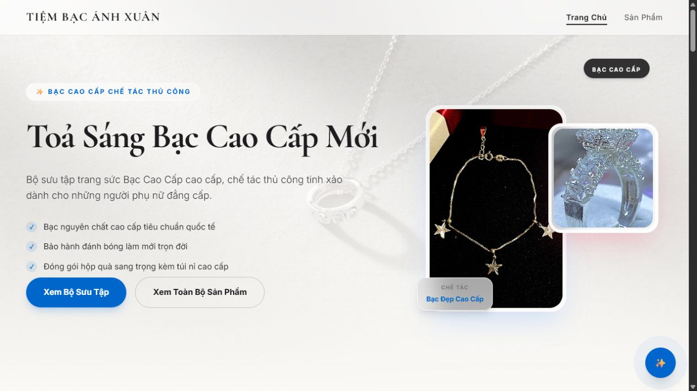
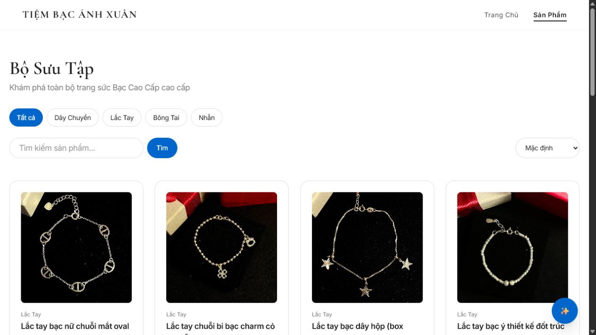
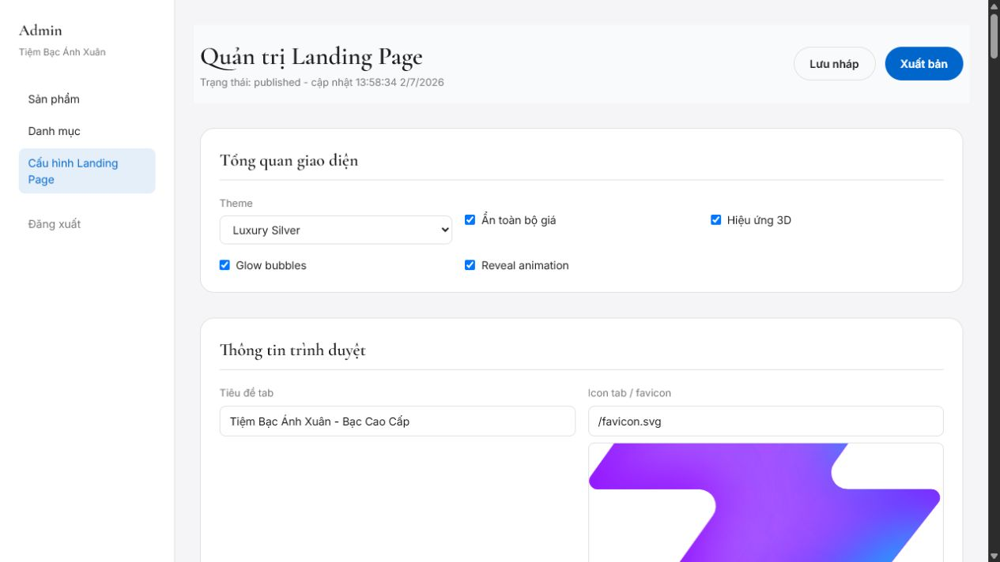

# Tiệm Bạc Ánh Xuân

Website giới thiệu và bán trang sức bạc cao cấp cho Tiệm Bạc Ánh Xuân. Dự án gồm landing page có hiệu ứng 3D, trang danh sách sản phẩm, chi tiết sản phẩm, đánh giá, widget liên hệ nhanh và khu vực admin để quản trị sản phẩm, danh mục, nội dung landing page, footer, tiêu đề tab và favicon.

## Hình ảnh







## Tính năng chính

- Landing page có hero, danh mục nổi bật, sản phẩm nổi bật, cam kết, câu chuyện thương hiệu, newsletter, footer và hiệu ứng 3D/reveal.
- Trang sản phẩm có lọc theo danh mục, tìm kiếm, sắp xếp giá và hiển thị trạng thái liên hệ khi ẩn giá.
- Trang chi tiết sản phẩm có thư viện ảnh, thông tin sản phẩm và đánh giá khách hàng.
- Admin đăng nhập bằng JWT, quản lý sản phẩm, danh mục, upload ảnh và bật/tắt sản phẩm nổi bật.
- Admin cấu hình landing page theo dạng draft/publish, có lịch sử xuất bản và rollback.
- Admin thay đổi được tiêu đề tab, favicon, footer, thông tin liên hệ, liên kết mạng xã hội và các khối nội dung trên landing page.

## Công nghệ

- Frontend: React 19, TypeScript, Vite, Tailwind CSS 4, React Router, Axios.
- Backend: Express, TypeScript, Prisma, SQLite, JWT, Multer.
- Database: SQLite qua Prisma.
- Tooling: Oxlint, Vite proxy cho `/api` và `/uploads`.

## Cấu trúc thư mục

```text
.
+-- src/                  # Frontend React
|   +-- pages/            # Trang public và admin
|   +-- components/       # Component dùng chung
|   +-- api.ts            # API client và type dùng chung
+-- server/               # Backend Express
|   +-- src/
|       +-- routes/       # API routes
|       +-- services/     # Logic landing config
|       +-- middleware/   # Auth middleware
+-- prisma/               # Prisma schema, migration, seed, SQLite DB
+-- public/               # Asset tĩnh
+-- docs/screenshots/     # Ảnh minh hoạ README
```

## Cài đặt

Yêu cầu Node.js và npm. Trên Windows PowerShell, nếu `npm` bị chặn bởi execution policy thì dùng `npm.cmd`.

```bash
npm install
cd server
npm install
```

Tạo file môi trường cho backend nếu chưa có, thường là `server/.env`:

```env
DATABASE_URL="file:./dev.db"
JWT_SECRET="change-me"
PORT=3001
```

Khởi tạo Prisma khi cần tạo lại database. Chạy các lệnh này từ thư mục gốc dự án:

```bash
npx prisma generate
npx prisma migrate dev
npx prisma db seed
```

Tài khoản admin mặc định từ seed:

```text
Email: admin@tiembacanhxuan.vn
Mật khẩu: admin123
```

## Chạy local

Mở 2 terminal.

Terminal backend:

```bash
cd server
npm.cmd run dev
```

Terminal frontend:

```bash
npm.cmd run dev
```

Sau đó mở:

- Website: http://localhost:5173
- Admin: http://localhost:5173/admin/login
- API backend: http://localhost:3001/api

## Build

Frontend:

```bash
npm.cmd run build
```

Backend:

```bash
cd server
npm.cmd run build
```

## API nổi bật

- `POST /api/auth/login`: đăng nhập admin.
- `GET /api/categories`: danh sách danh mục.
- `POST /api/categories`: tạo danh mục, cần token admin.
- `GET /api/products`: danh sách sản phẩm, hỗ trợ `category`, `search`, `sort`, `featured`.
- `POST /api/products`: tạo sản phẩm, cần token admin.
- `POST /api/upload`: upload ảnh, cần token admin.
- `GET /api/landing`: lấy cấu hình landing page public.
- `PUT /api/landing/admin/draft`: lưu nháp landing page, cần token admin.
- `POST /api/landing/admin/publish`: xuất bản landing page, cần token admin.
- `POST /api/landing/admin/rollback/:id`: rollback cấu hình landing page, cần token admin.

## Ghi chú vận hành

- Frontend gọi API qua base URL `/api`; Vite proxy sang backend ở `http://localhost:3001`.
- Ảnh upload được backend phục vụ qua `/uploads`.
- Nếu đổi nội dung landing page trong admin, hãy bấm `Lưu nháp` hoặc `Xuất bản` tuỳ nhu cầu.
- Nếu đổi tiêu đề tab hoặc favicon, cấu hình nằm trong phần `Thông tin trình duyệt` của trang admin landing.
